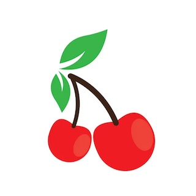

<p align="center">
    
</p>
<p align="center">简单，实用的Vue UI 库</p>

# Cherry-Design


访问地址： https://alanuuu.github.io/cherry-design/

## 一、 开发
```bash
# 安装依赖
yarn

# 软链package
yarn bootstrap

# 构建vue-ui
yarn build

# 文档预览
yarn dev
```
